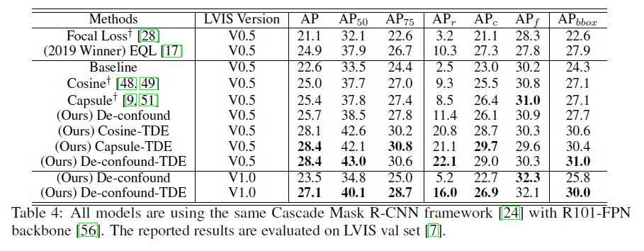

# Long-Tailed Object Detection and Instance Segmentation

This project is built on top of [mmdetection V2.4](https://github.com/open-mmlab/mmdetection). The main body of the proposed Causal-TDE is under [./mmdet/models/roi_heads/bbox_heads/convfc_bbox_head.py](mmdet/models/roi_heads/bbox_heads/convfc_bbox_head.py). 

You can check the [documentation](https://mmdetection.readthedocs.io/) for more guidance of using mmdetection, but if you just want to quickly try our method, you can run the following commands.


### Training
```bash
CUDA_VISIBLE_DEVICES=0,1,2,3,4,5,6,7 PORT=112222 bash ./tools/dist_train.sh configs/htc/htc_r101_fpn_20e_causal.py 8 --work-dir work_dirs/htc_r101_fpn_20e_causal --no-validate
```

The hyper-parameters of the proposed TDE are actually in convfc_bbox_head.py rather than the config file. Note that using --no-validate will save lots of time, because LVIS V1.0 has a much larger validation set.


### Testing
```bash
CUDA_VISIBLE_DEVICES=0,1,2,3,4,5,6,7 PORT=112222 bash ./tools/dist_test.sh configs/htc/htc_r101_fpn_20e_causal.py work_dirs/htc_r101_fpn_20e_causal/latest.pth 8 --eval bbox segm
```

### Background Fixed TDE
This is a very useful trick to apply TDE on object detection or instance segmentation. As we discussed in our supplementary materials, In object detection and instance segmentation tasks, the existing frameworks usually need a background category for the classifier to filter the trivial regions, which is also a head class. However, the preference towards the background is not just a good bias but also an essential bias. Otherwise, the results will be full of meaningless trivial bounding boxes or regions. Therefore, we propose a background-fixed TDE that freezes the foreground / background probability ratio before and after the TDE for each prediction. The background-fixed TDE can be formulated as:


The results with and without background-fixed TDE are reported as follows:


As we can see, the background-fixed strategy successfully prevents the TDE from hurting the foreground-background selection. It is the key to apply TDE in tasks like object detection and instance segmentation that include one or more legitimately biased head categories, i.e., this strategy allows us to conduct TDE on a selected subset of categories.

### Results

